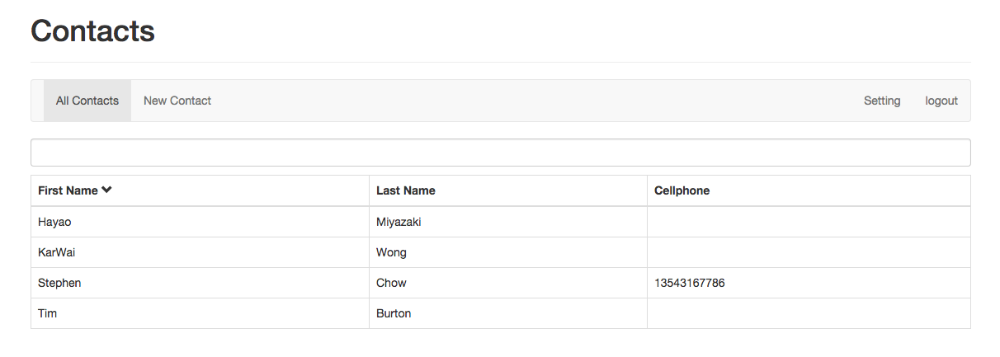
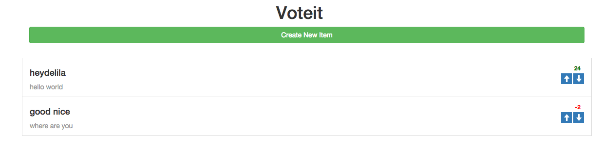

exercises-FrontendFramework
===========================
关于前端框架的一些练习项目。

1. Angular -Contacts
=========================
201505

### 描述

使用Angular和Nodejs实现一个简易的Web App通讯录，支持增删改查、搜索、设置显示列、以及用户权限控制(signup,login,logout)。

### 资源
	
- [tutsplus - Building a web app from scratch with angular](https://code.tutsplus.com/courses/building-a-web-app-from-scratch-with-angularjs)

2. ReactJS －Voting
=========================
201506

## 描述

一个使用 React.js 做的简易投票系统，可新增项目、为项目投票，并实时渲染投票结果。

## 启动
`gulp serve`

## 涉及

- Gulp -task runner
- Browserify - 模块化
- Reactify －jsx transformer
- [Firebase](https://www.firebase.com/) - Realtime Database
- [Lo-Dash](https://lodash.com/docs) -  JS 工具库

## 基本架构

	main
		> addbutton
		> feedform
		> feedlist
			> feeditem

## 添加事件

1. 顶级模块与子类模块的通信：
	- 和 `<AddBtn>` 的通信： isShowBtn, onButtonClick();
	- 和 `<FeedForm>` 的通信： isShowForm;
	- 和 `<FeedItem>` `<FeedList>` 的通信： onVote();	
	- 和 `<FeedForm>` 的通信： onNewItem().

2. 交互
	1. 按钮
		- 点击 add 按钮，toggle 表单的展现，同时改变按钮的样式和文字
	2. 表单
		- 填写 `title` 和 `desc` ，点击按钮，grid 中即时新增一条记录。同时重置 form。
		- refs: `title`, `desc`, `form`; 注意写法： `this.refs.title.getDOMNode().value`
	3. 箭头
		- 点击上下按钮增减投票数，低于0票时显示红色样式

## 连接数据库 －Firebase

- [Firebase官网](https://www.firebase.com/)
- 安装： 
	- `npm install firebase`
- 特性
	- Realtime Database
		- 主动推送，是基于websocket的吗？
	- Stored as JSON objects
- 方法
	- 引入： `new Firebase('https://react-vote.firebaseio.com/);`
	- 监听： on('value', function(){})
	- 新增： .push()
	- 更新： .update()
	- 过滤： .child()

## 资源

- [tutsplus - Getting started with reactjs](https://code.tutsplus.com/courses/getting-started-with-reactjs/lessons/jsx-vs-reactdom)

3. Backbone -Todos
=========================

201407

### 描述
- 一个简易的 todos 应用，可增加项目、删除项目、过滤项目。

### Tech Points
- BackboneJS
- Unit Testing: mocha, chai, sinon
- Code coverage report: blanketJS

### References & Resources
- https://github.com/sathomas/jsunittest -by Stephen A Thomas
- http://documentcloud.github.io/backbone/docs/todos.html -by Jérôme Gravel-Niquet

###  Live demo:
- Demo: http://heydelilah.github.io/exercises-FrontendFramework/backbone-todos/index.html
- Unit testing: http://heydelilah.github.io/exercises-FrontendFramework/backbone-todos/test.html

